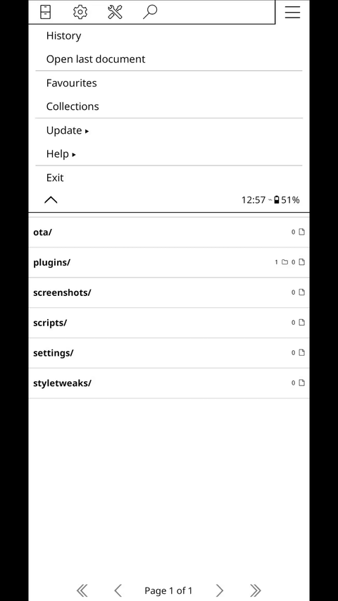

# [KOReader Z-library Plugin](https://github.com/ZlibraryKO/zlibrary.koplugin)

English | [简体中文](./README.zh-CN.md)

**Disclaimer:** This plugin is for educational purposes only. Please respect copyright laws and use this plugin responsibly.

Access Z-library seamlessly within your KOReader application. This plugin allows you to browse and download content directly to your e-reader.

If you find this plugin helpful, please consider supporting its development. Your donations help keep the project alive and allow for new features and improvements.

<a href="https://buymeacoffee.com/zlibraryko" target="_blank"></a>

## Demo

<div align="center">
  
</div>


## Features

*   Search Z-library for books.
*   Filter search results by language and file extension.
*   Browse most popular and recommended books.
*   Download content directly to your device.


## Prerequisites

*   KOReader installed on your device.
*   A Z-library account.
*   A Z-library url.

## Installation

1.  Download the latest release.
2.  Copy the `plugins/zlibrary.koplugin` directory to the `koreader/plugins` folder on your device.
3.  Restart KOReader.

## Configuration

There are two ways to configure your Z-library credentials:

**1. Via the KOReader User Interface (UI):**

1.  Ensure you are in the KOReader file browser.
2.  Access the "Search" menu.
3.  Select "Z-library" (it's probably on the second page of this menu).
4.  Select "Settings".
5.  Enter your Z-library username, password, and the base URL for your Z-library instance.
6.  Adjust other settings if needed.

**2. Via a Credentials File (Advanced):**

For a more permanent or automated setup, you can create a file named `zlibrary_credentials.lua` in the root of the `zlibrary.koplugin` directory (e.g., `koreader/plugins/zlibrary.koplugin/zlibrary_credentials.lua`).

This file allows you to override the credentials set in the UI. If this file exists and is correctly formatted, the plugin will use the values from this file.

Create the `zlibrary_credentials.lua` file with the following content, uncommenting and filling in the details you wish to use:

```lua
-- This file allows you to override Z-library credentials.
-- Uncomment and fill in the details you want to override.
-- Values set here will take precedence over those set in the plugin's UI.

return {
    -- baseUrl = "https://your.zlibrary.domain",
    -- username = "your_username",
    -- password = "your_password",
}
```

**Note:** Credentials set in the `zlibrary_credentials.lua` file will always take precedence over those set via the UI. The plugin loads these settings at startup.

## Setup gesture (optional)

To easily access this plugin, you can set up a gesture to open the search menu:

1.  Open the top menu and tap the **Cog (⚙️)** icon.
2.  Navigate to **Taps and gestures** > **Gesture manager**.
3.  Select your desired gesture in two steps.
4.  Under **General**, find **Z-library search** on the last page and check the box.


## Localization Support

This plugin provides basic multilingual support. To improve or add translations, please follow these steps:

### How to Translations
1. **Locate PO Files**
   - Navigate to the plugin's `l10n` directory:
     ```
     koreader/plugins/zlibrary.koplugin/l10n/{language_code}/koreader.po
     ```
   - Example (Japanese):
     ```
     zlibrary.koplugin/l10n/ja/koreader.po
     ```

2. **Add New Language**
   - If your language is not supported:
     1. Create a folder named with [ISO 639-1 language code](https://en.wikipedia.org/wiki/List_of_ISO_639-1_codes) (e.g. `zh_CN` for Chinese, `fr` for French)
     2. Copy the template file `l10n/koreader.pot` to the new folder
     3. Rename it to `koreader.po` and edit the translation content

3. **Edit PO Files**
   - Use a text editor or tools like [Poedit](https://poedit.net/) to translate `msgstr` fields (do not modify `msgid`)
   - You can also submit your translation via **Pull Request** to help more users!

**Note:**
- The plugin will automatically load translations based on koreader language
- Will fall back to English if translation is missing

## Usage

1.  Ensure you are in the KOReader file browser.
2.  Access the "Search" menu.
3.  Select "Z-library".
4.  Select "Search" and enter your search query.
5.  Or select "Recommended" or "Most popular" to browse those lists.

## Keywords

KOReader, Z-library, e-reader, plugin, ebook, download, KOReader plugin, Z-library integration, digital library, e-ink, bookworm, reading, open source.
